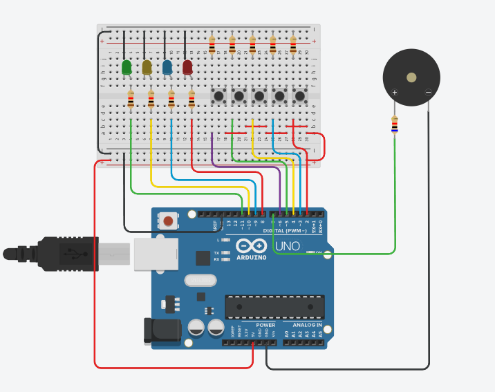

<h1 align="center"> Colors Memory. 🧠</h1>
<div align="center">
  
  
  
  
</div>


# Índices 🗂
* [Sobre](#sobre-)
* [Fotos](#Fotos-)
* [Como usar](#como-usar-)

# Sobre ☄

Um joguinho de memória com cores simples feito com Arduino.

O funcionamento do jogo é simples.
O circuito irá lhe mostrar uma sequência e você tem que repeti-la. A cada sequência completa, o jogo irá aumentar em um a quantidade de cores para a sequência. O jogo possui um sistema de record, então você terá um incentivo para sempre melhorar no jogo.
Este código é uma reformulação de um antigo. Este projeto já foi feito por mim, mas preferi refazer o código para adicionar melhorias. 

Este projeto possui uma versão física, mas, no repositório, vou deixar uma versão para o Tinkercad caso alguém se interesse. Pois, algumas funções existentes no Arduino não possuem no simulador. Além de que quando o código para a versão física estiver completa, ela vai possuir código para um componente a mais que é uma pequena tela. Essa tela não está disponível no simulador. 

Obs: O código para o simulador está completo. Infelizmente a função de record não funcionará,  pois no simulador não é possível utilizar o EPROM. Então o record nunca será salvo. Sempre que a placa for desligada será perdido o record. Mas isso apenas para o código do simulador.

# Fotos 📸
<div display="inline" align="center">

Pretendo colocar fotos futuramente do projeto físico

</div>

# Como usar 💻

 - Se você possui experiência com Arduino, não será problema para você colocar o código na placa. Mas se não for o caso, recomendo pesquisar sobre brevemente

 - Caso pretenda utilizar o código com o display (`colorsMemory.ino`), as ligações do display oLED que foi utilizado são padrões do display. Utilize os pinos A4 (SDA) e A5 (SCL) do Arduino. Também precisa que você incluia a blibiotéca  `Adafruit_SSD1306.h` junto a suas depências em seu projeto para gerenciar o display

  - Está disponivel também a opção de reiniciar o recorde. Basta apenas enviar "r" pelo monitor serial do Arduino e seu recorde vai ser reiniciado

  - Mesmo que não utilize o display, a contagem do recorde atual vai estar disponivel no monitor serial

### Materiais:
 - 4 LED’s (uma de cada cor)
 - 8 resistores (escolha a resistência como desejar. Vai interferir apenas no brilho das LED’s)
 - 1 resistor para o buzzer (opcional)
 - 5 botões
 - 1 buzzer

Siga a imagem do circuito para colocar os componentes no lugares certos:



OBS: caso pretanda utilizar outras portas, basta apenas altera os arrays que contem as portas dos botões e LEDs e manter a ordem para cada respectivo componente

``` c++

int leds[] = {3, 6, 9, 12};        <<<
int buttons[] = {2 , 5, 8, 11, 4}; <<< // Ultimo valor se refere ao botão
int Tone[] = {262, 196, 220, 247};    //  que vai parar/iniciar o jogo

```

<hr>
<div align="center">

Criado por [Iago Amorim](https://github.com/danonep2).

</div>
